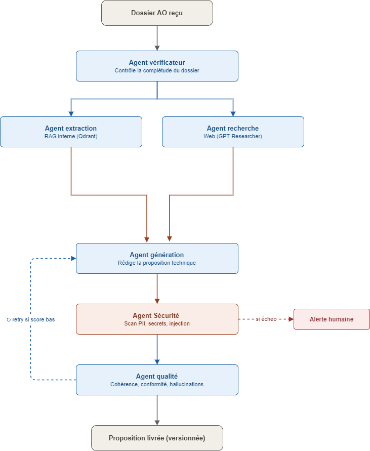

https://github.com/user-attachments/assets/7ac8eb5a-341e-466c-b6b9-6a536da5155c
# Tender Desk — RFP Pipeline

An end-to-end system that takes a tender/RFP document and turns it into a
draft technical proposal: verify → extract requirements & research the
market (in parallel) → generate a full draft → run it through a
**security gate** and a **quality gate** — grounded in your own
company's past proposals, CVs, and project references via RAG.

## Project structure

This repo has 3 parts, each in its own folder:

```
.
├── anything-llm-lightweight/   # The RAG backend — a stripped-down AnythingLLM
│                                 server. Stores documents, does embeddings,
│                                 vector search, and workspace-grounded chat.
│
├── rfp-pipeline/                # The pipeline itself — 6 LangGraph agents
│                                 (Verifier, Extraction, Research, Generation,
│                                 Security, Quality) plus a FastAPI backend
│                                 exposing them as a REST API for the UI.
│                                 See "Pipeline agents" below for what each
│                                 one actually does.
│
└── frontend/                    # "Tender Desk" — the React (Vite) UI: upload
                                  a tender, watch it move through the pipeline
                                  live, read/download the draft proposal,
                                  manage the company knowledge base.
```

## How the pieces fit together



- The **frontend** never talks to AnythingLLM directly — it only calls the
  `rfp-pipeline` FastAPI backend.
- The **pipeline** (`rfp-pipeline/`) is the orchestrator: each agent calls
  into AnythingLLM for document storage, embeddings, and RAG-grounded
  chat, plus GPT Researcher for live web research.
- **AnythingLLM** is the actual document store + vector DB + LLM chat
  layer underneath everything.

## Pipeline flow

```
verifier → (blocked?) → END
        └→ dispatch ──┬→ extraction ─┐
                       └→ research   ─┴→ generation → security → (blocked?) → END (human alert)
                                                                └→ quality → (retry?) → generation
                                                                          └→ END (done or failed)
```

- **Extraction and Research run in parallel** — neither depends on the
  other, and both feed into Generation. `dispatch` is internal plumbing
  (a no-op node needed so the "is verified?" gate only has to be checked
  once before fanning out to both branches) — it's filtered out of the
  UI stepper, not a real pipeline stage.
- **Security is a hard gate**: if it fails, the run goes straight to
  `END` for human review — no automatic retry.
- **Quality is a graded gate**: if it fails, the run loops back to
  Generation for another attempt, up to 3 times, before giving up.

## Pipeline agents

| Agent | Runs | Reads | Writes | Can it block/retry the run? |
|---|---|---|---|---|
| **Verifier** | 1st | the uploaded tender file | `is_verified`, `workspace_slug` | Blocks (bad file/format) |
| **Extraction** | parallel w/ Research | tender doc (via RAG) | `requirements` | No |
| **Research** | parallel w/ Extraction | open web | `research_summary` | No |
| **Generation** | after both join | requirements, research, company KB | `draft_proposal` | No |
| **Security** | after Generation | the draft | `security_passed`, `security_report` | **Blocks — no retry** |
| **Quality** | after Security passes | the draft | `quality_passed`, `quality_report` | **Retries Generation** (up to 3x) |

**Verifier** — checks the tender file exists, is a supported format
(PDF/DOCX), and isn't suspiciously small/corrupt, before any LLM calls
happen. If it passes, it also does the one-time setup work: creates a
fresh AnythingLLM workspace for this run and uploads/embeds the tender
document into it, since every later agent needs that workspace to exist.

**Extraction** — pulls structured facts out of the tender via
RAG-grounded chat (`mode="query"`, so AnythingLLM only answers from the
embedded document, no general LLM knowledge): scope summary,
deliverables, deadlines, budget, evaluation criteria, selection method.
Includes a JSON-repair step for a real failure mode — if the model's
response gets cut off mid-object by a token limit, it walks the partial
text, closes the dangling brackets, and flags the repaired result with
an `_extraction_note` so you know to spot-check the last field rather
than trusting it blindly, instead of just discarding a mostly-good
response.

**Research** — runs autonomous web research via `gpt-researcher` on the
market/competitor landscape for this tender, building its query from the
tender's scope and selection method. Runs in parallel with Extraction,
which means it starts from the *same pre-fork state* Extraction does —
so it currently can't see Extraction's output when building its research
query (a known trade-off of the parallelization, not a bug).

**Generation** — the join point: only runs once *both* Extraction and
Research have finished. Writes a full multi-section technical proposal
report (Executive Summary, Understanding of Requirements, Approach &
Methodology, Work Plan, Risk Management, Proposed Team, Why Us), grounded
in the extracted requirements, the research report, and 3 searches
against the company knowledge base (past proposals, CVs, project
references). Explicitly instructed not to invent names, figures, or
project details not present in that material — uses `[TO BE CONFIRMED]`
placeholders instead.

**Security** — a hard, non-retriable gate. Scans the generated draft
with LLM Guard's `Sensitive` (PII that leaked into the draft — e.g. a
stray email pulled in from a CV excerpt) and `MaliciousURLs` scanners.
The `MaliciousURLs` check also doubles as the pipeline's best available
signal against **indirect prompt injection**: since Research pulls
content from the open web, a poisoned page is a classic vector for
smuggling malicious links or instructions into what Generation later
treats as trusted context. This isn't a dedicated injection detector —
it's flagged as a known limitation, not a guarantee. Any finding blocks
the run for human review rather than retrying, since a PII leak or a
malicious link isn't something an LLM should silently "try again" its
way out of. Falls back to a naive regex PII check if `llm-guard` isn't
installed.

**Quality** — runs only if Security passed. Checks the draft's *quality*,
not its safety: template compliance (are all required sections present),
minimum word count, and (via LLM Guard) `ToxicLanguage` (tone
appropriateness) and `NoRefusal` (catches the generation model punting
instead of writing a section — a common failure mode). Unlike Security,
a failure here is graded and triggers an automatic retry of Generation,
up to 3 attempts, before the run is marked failed.

## Quick start

You need all three running at once, in this order:

### 1. AnythingLLM server
```powershell
cd anything-llm-lightweight/server
yarn install       # first time only
yarn dev            # or however you normally start it
```
Confirm it's up at `http://localhost:3001`.

### 2. Pipeline backend
```powershell
cd rfp-pipeline
python -m venv .venv
.venv\Scripts\Activate.ps1
pip install -r requirements.txt
uvicorn backend.api:app --reload --port 8000
```
Confirm it's up at `http://localhost:8000/api/health`.

### 3. React frontend
```powershell
cd frontend
npm install
npm run dev
```
Open `http://localhost:5173`.

Full setup details, environment variables, and troubleshooting notes for
the pipeline specifically are in [`rfp-pipeline/README.md`](rfp-pipeline/README.md).

## What the UI does

**Pipeline tab**
- Upload a tender (PDF/DOCX) and watch it move live through the pipeline
- See the Verifier's blocking reasons if a tender fails pre-flight checks
- Read the Extraction agent's structured requirements (deliverables,
  deadlines, budget, evaluation criteria)
- Read the Research agent's market/competitor report
- Read and download the generated draft proposal
- See the Quality gate's results — word count, template compliance,
  toxicity, and refusal-detection findings


**Knowledge base tab**
- Manage the 3 persistent company workspaces (past proposals, CVs,
  project references) that the Generation agent draws on
- Drag-and-drop upload documents straight into any of them

## Environment variables

Copy `rfp-pipeline/.env.example` to `rfp-pipeline/.env` and fill in real
values:

| Variable | What it's for |
|---|---|
| `ANYTHINGLLM_BASE_URL` | Where the pipeline reaches the AnythingLLM server (default `http://localhost:3001/api`) |
| `GROQ_API_KEY` | API key for Groq — GPT Researcher's LLM connection in this setup |
| `FAST_LLM` / `SMART_LLM` / `STRATEGIC_LLM` | Which model GPT Researcher uses for each internal role. With Groq, these are prefixed model strings, e.g. `groq:llama-3.3-70b-versatile` |
| `EMBEDDING` | Embedding model GPT Researcher uses for its own retrieval (separate from AnythingLLM's embeddings). **Groq is not a supported embedding provider** — point this at something else (e.g. `openai:text-embedding-3-small`, or `ollama:nomic-embed-text` if running a local embedder) |
| `RETRIEVER` | Search backend GPT Researcher uses (e.g. `duckduckgo` for a free option, or a Tavily API key for better results) |

Example `.env` values for a Groq-based setup:
```
GROQ_API_KEY=your_groq_key_here
FAST_LLM=groq:llama-3.1-8b-instant
SMART_LLM=groq:llama-3.3-70b-versatile
STRATEGIC_LLM=groq:llama-3.3-70b-versatile
EMBEDDING=openai:text-embedding-3-small
RETRIEVER=duckduckgo
```
(Double-check current Groq model names at [console.groq.com](https://console.groq.com/docs/models) — they change over time as models get deprecated/added.)

## Screenshots

<!-- Add screenshots here, e.g.:


-->

## Status / known limitations

- Pipeline run history is in-memory in the FastAPI backend — restarting
  it loses run history (fine for local/dev use, not for production).
- **The UI hasn't caught up to the Security agent or the parallel
  Extraction/Research split yet** — see the callout above. This is the
  main thing to fix next.
- Research runs in parallel with Extraction, so it currently can't see
  Extraction's output (requirements) when building its search query —
  both start from the same pre-fork state (see `research_agent.py`).
- LLM Guard (used by both Security and Quality) is a heavy optional
  dependency — downloads ML models on first run. Both agents fall back
  to cruder checks (naive regex PII for Security, no toxicity/refusal
  check at all for Quality) if it isn't installed.
- Security's `MaliciousURLs` scan is the best available proxy against
  indirect prompt injection from Research's web content, but it's not a
  dedicated injection detector — treat it as a partial mitigation, not a
  guarantee.
- CORS on the FastAPI backend is wide open for local dev convenience —
  tighten this before exposing anything beyond localhost.


  #Demo
  

Uploading demo.mp4…

